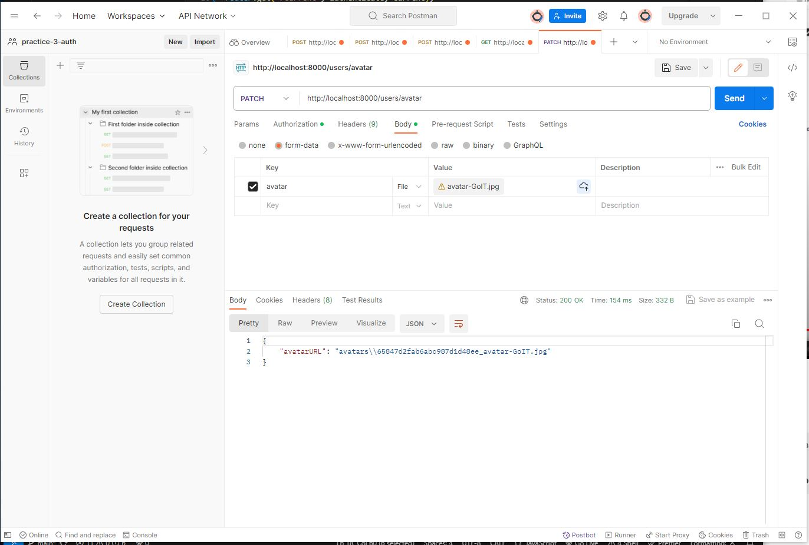
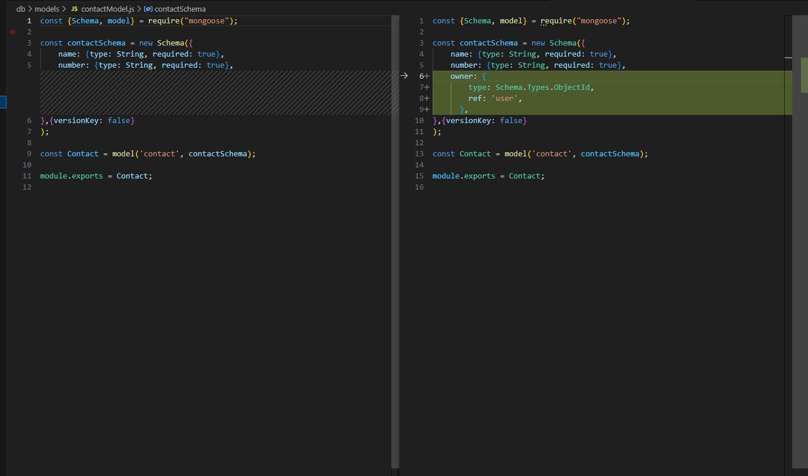
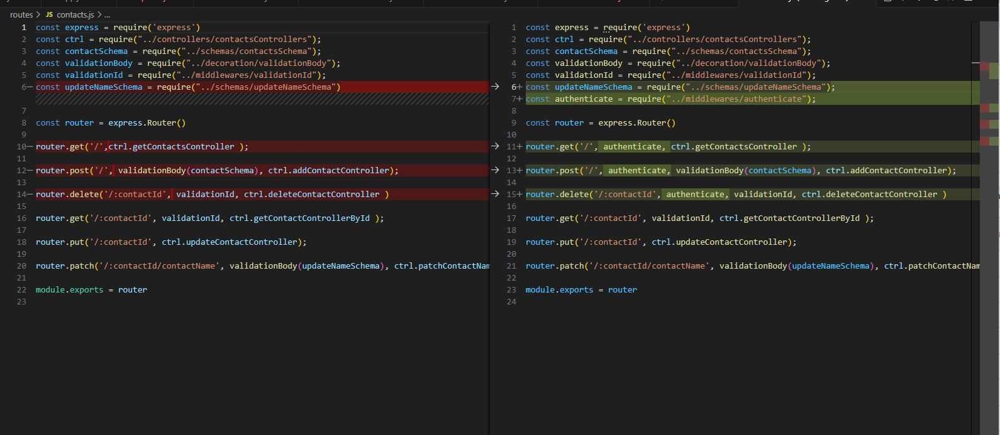
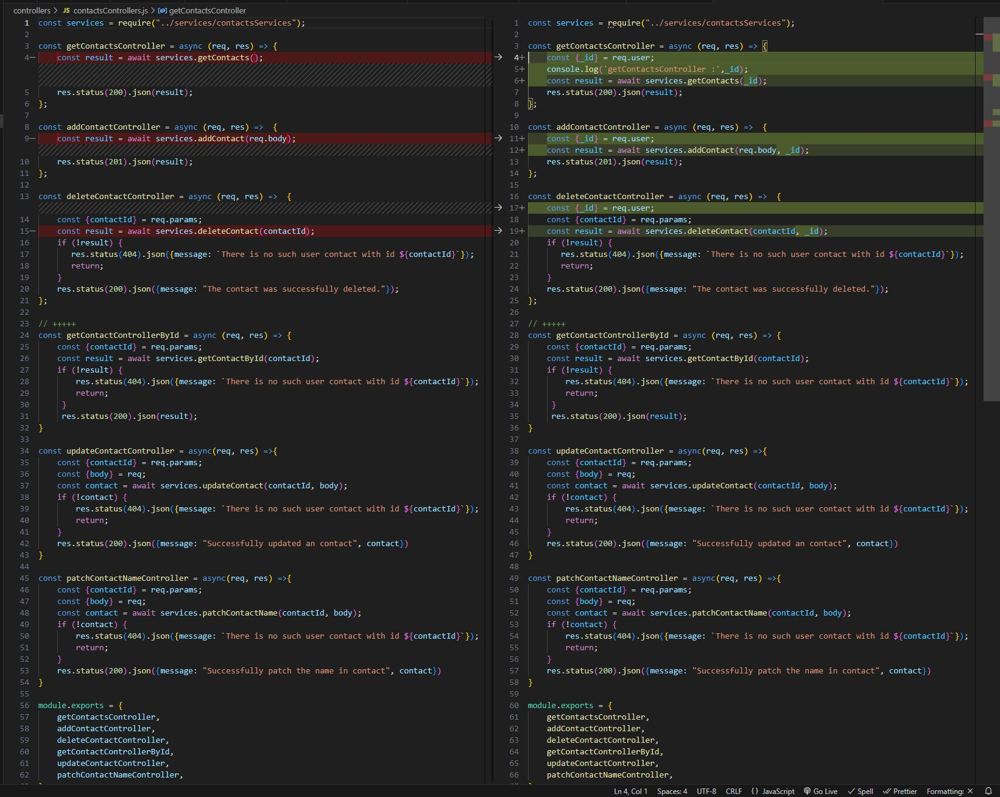
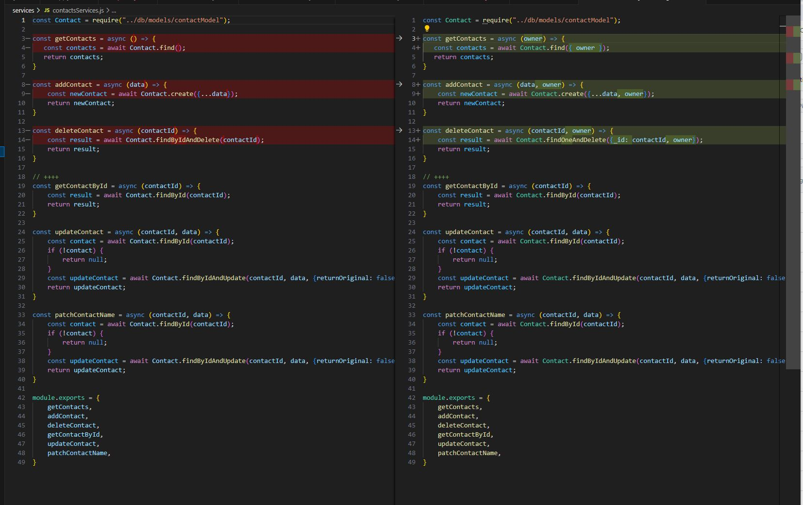

### node.js-practice-4-auth-logout

#### - logout -  POST http://localhost:8000/users/
-> res.  
{    
  
}   

"204 No Content"   

#### - current - GET http://localhost:8000/users/
-> res.  
{  
    "email": "mail2@mail.net",   
    "name": "igor2",  
    "avatar": "//www.gravatar.com/avatar/  fc8a7a3da1b6cd01e2b7471d812d63cb"   
}  

Frontend  
https://github.com/IgorMushk/node.js-practice-4-auth-frontend-hw8

#### - avatar - GET http://localhost:8000/users/avatar  

### Add only owner contacts - get / delete

1. models/contactModel.js

2. routes/contacts.js

3. controllers/contactsControllers.js 

4. services/contactsServices.js

